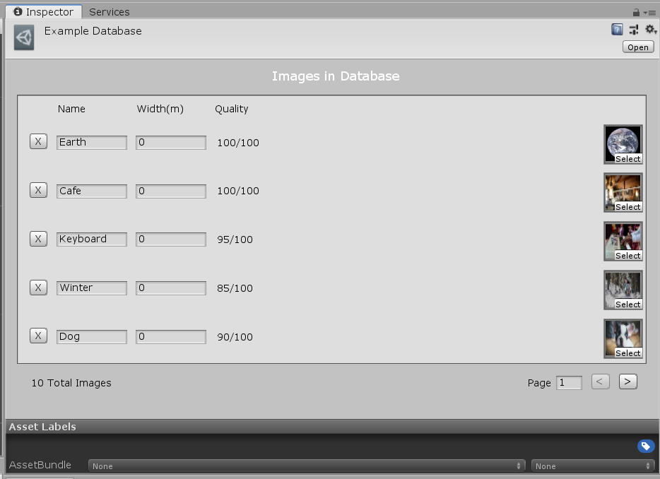
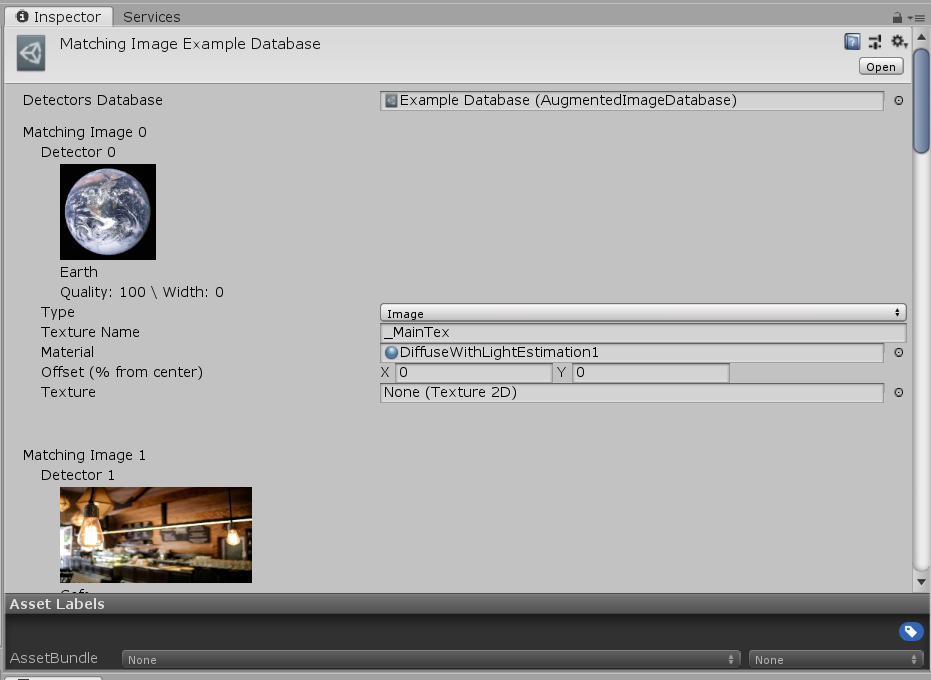
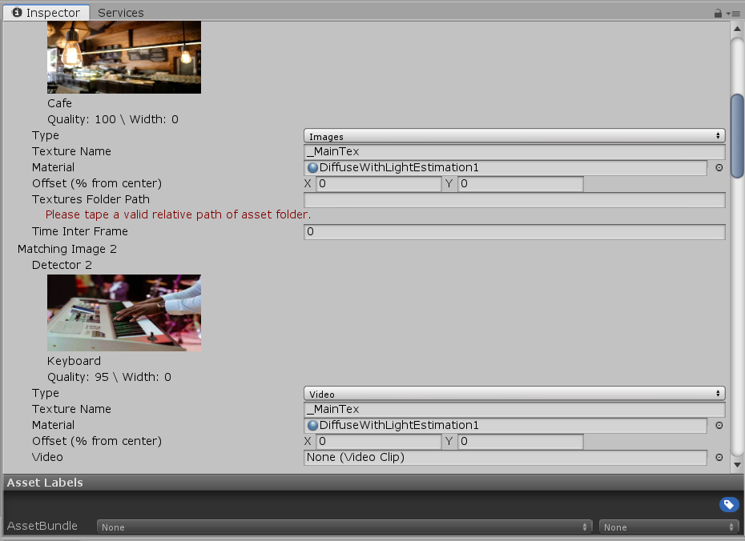
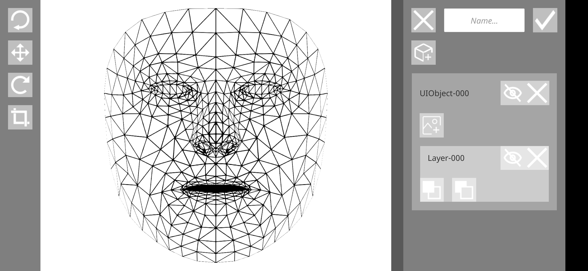
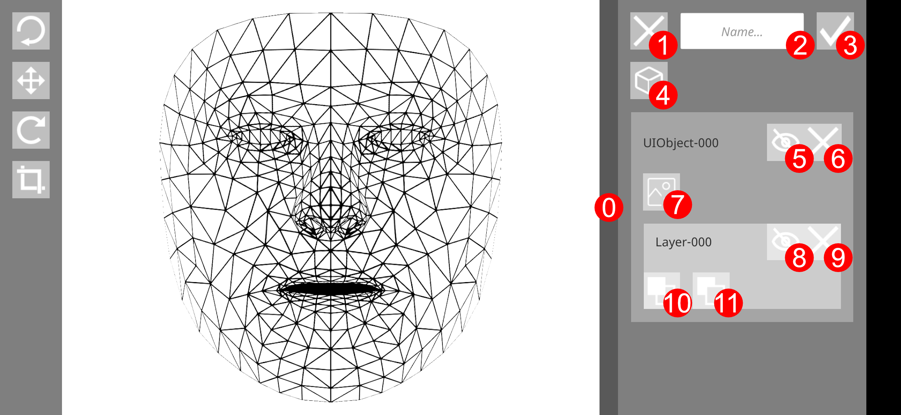
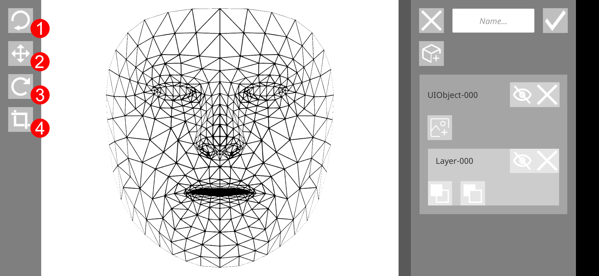

# ARPrototype

ARPrototype propose un prototype d'une application explorant deux versants de la réalité augmentée au travers du framework [Google ARCore](https://developers.google.com/ar/) : la reconnaissance d'images 2D et la reconnaissance de visages. Une autre fonctionnalité non exploitée dans le cadre de ce prototype est la reconnaissance de surfaces planes horizontales et verticales.

ARPrototype propose en plus un atelier permettant la création dynamique de *faces* qui peuvent ensuite être utilisées dans le cadre de la reconnaissance de visages.

## Comment ça marche ?

### Augmented Image

**Affiche image ou vidéo sur une ou plusieurs images détectées.**

#### Avant la compilation de l'application

Pour fonctionner *Augmented Image* à besoin de deux bases de données, l'une générée à l'aide de l'outil de Google ARCode permet la création d'une base de données des images detecteurs, l'autre générée à l'aide des outils de *ARPrototype* à partir de la précédente base de données permet l'association entre une image détecteur et une image ou vidéo correspondante.

1.  Créer la base de données des images détecteurs dans *Unity* en sélectionnant l'ensemble des images et en effectuant soit un clic-droit soit en passant directement par le menu *Create* puis *Google ARCode* puis *AugmentedImageDatabase* de l'outil *Project*. En la selectionnant, certains paramètres peuvent être configurés tel que *Width(m)*.
    
    

2.  Créer la base de données des images correspondantes en effectuant soit un clic-droit soit en passant directement par le menu *Create* puis *MatchingImageDatabase*.

3.  Configurer la base de données des images correspondantes en complétant les différents champs.

    

    

    - **Detector #** rappel les différents éléments de l'image détecteur.

    - **Type** définit le type d'image de la correspondance : image, suite d'images ou vidéo.

    - **Texture Name** définit la variable du shader dans lequel est contenue l'image. Normalement ce champs n'est pas à changer.

    - **Material** définit le matériau utilisé par le maillage en charge d'afficher l'image correspondante.

    - **Offset (% from center)** définit un décalage à partir du centre de l'image détecteur sur l'axe X ou Y en pourcentage de la taille de l'image. Ce paramètre est modifiable par l'utilisateur lors de utilisation de *Augmented Image*.

    - **Image** (visible si le type est **image**) définit l'image à utilisée pour la correspondance.

    - **Textures Folder Path** (visible si le type est **images**) définit le dossier dans lequel est placée la suite d'image à utiliser pour la correspondance.

    - **Time inter Frame** (visible si le type est **images**) définit le temps d'apparition d'une image dans une suite d'images.

    - **Video** (visible si le type est vidéo) définit la vidéo à utiliser pour la correspondance.

4.  Associer la base de données des images détecteurs dans le fichier *ARSessionConfig* en cours d'utilisation par le composant *AR Core Session* du préfabriqué *ARCore Device*.

5. Associer la base de données des images correspondantes au composant *Augmented Image Worker* du l'objet de jeu *Worker*.

6. L'application peut maintenant être compilée.

#### Durant l'exécution

Placer l'appareil devant l'image tout en vérifiant que le capteur photographique capte l'image détecteur en entier. Dans le cas d'un détecteur enregistré, une roue de chargement devrait apparaitre et tourner au centre de l'écran. Elle indique à l'utilisateur que l'image est en train d'être reconnue par le dispositif et que l'utilisateur doit continuer à tourner l'appareil autour du détecteur. Dès la reconnaisance effectuée, l'image correspondante apparait à la place du détecteur.

L'utilisateur dispose de la possibilité modifier l'**Offset (% from center)** en déplaçant l'image, les images ou la vidéo correspondantes sur l'axe X et Y avec son doigt placé dessus tout en le déplaçant.

### Augmented Face

**Affiche la face choisie sur le visage détecté.**

Les *faces* créées avec *Augmented Face Creator* se retrouvent listées en bas de l’écran. Une geste du doigt vers la gauche ou la droite permet de balayer l’ensemble des *faces*, un geste vers le haut en partant d’une *face* permet sa sélection.

Pour supprimer une *face*, il faut passer en dehors de l’application par un gestionnaire de fichiers et supprimer chacun des répertoires dans le dossier de l’application *com.LaFabulerie.ARPrototype* dans *files* puis *faces*.

Sous Android ce dossier regroupant l’ensemble des *faces* se trouve à l’adresse suivante : */Android/data/com.LaFabulerie.ARPrototype/files/faces*.

### Augmented Face Creator

**Crée une face qui sera ensuite possible d'utiliser dans *Augmented Face*.**

Le visage au centre correspond au maillage qui est projetté sur chaque visage détecté. L'effet de maille peut être être rendu invisible en masquant le *Layer-000* de l'*Object-000*.

La barre de droite contient les outils du module et l'ensemble des objets et des calques ainsi que leurs outils associés. Un clic sur un objet ou un calque permet sa selection qui se retrouve indiquée par un changement de couleur de la surface.

0. Zone grisée permettant l'agrandissement ou la réduction de la barre de gauche.

1. Retourne vers le menu principal sans enregistrer le travail en cours.

2. Définit un nom à la *face*.

3. Enregistre le travail en cours dans une nouvelle *face* et retourne vers le menu principal.

4. Ajoute un nouveau maillage sous la forme d'un plan en demandant de choisir une nouvelle image en guise de calque.

5. Masque le maillage.

6. Supprime le maillage dans le cas d'un maillage en forme de plan.

7. Ajoute un nouveau calque au maillage en demandant de choisir une image.

8. Masque le calque.

9. Supprime le calque dans le cas d'un calque suprimable.

10. Avance le calque d'un pas.

11. Recule le calque d'un pas.

La barre de gauche contient l'ensemble des outils disponibles pour le traitement des objets et des calques.

1. Reinitialise l'objet ou le calque selectionné.
    - Dans le cas d'un objet selectionné, la réinitilisation se charge de replacer l'objet sur son ancre en préservant la rotation et la mise à l'échelle de l'objet.
    - Dans le cas d'un calque selectionné, la réinitilisation se charge d'étirer l'image sur l'ensemble de la surface de l'objet. 

2. Active le mode de translation de l'objet ou du calque selectionné. La translation s'effectue par un geste à un doigt de déplacement sur l'écran.

3. Active le mode de rotation de l'objet ou du calque selectionné. La rotation s'effectue par un geste de rotation de deux doigts posés sur l'écran.

4. Active le mode de mise à l'échelle de l'objet ou du calque selectionné. La mise à l'échelle s'effectue par un geste de pincement sur l'écran.
    - Horizontalement, le recadrage s'effectue sur l'axe X.
    - Verticalement, le recadrage s'effectue sur l'axe Y.
    - En diagonale, le recadrage s'effectue sur les deux axes X et Y afin de conserver la proportion.